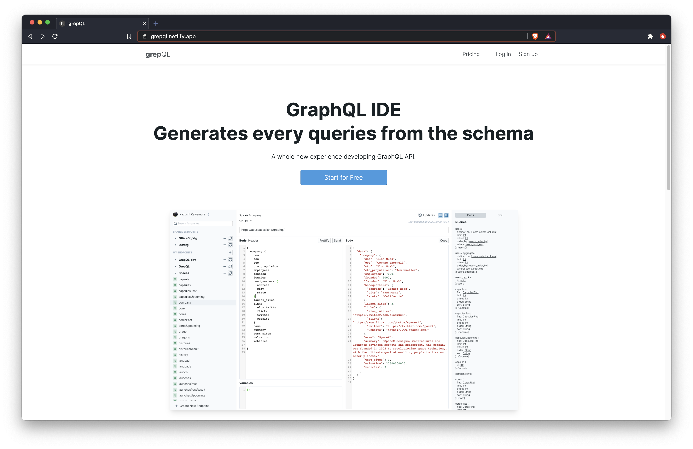

# grepQL - GraphQL IDE

Generates every queries from the schema

## What is grepQL?

### Never write queries again

grepQL will fetch the schema from your GraphQL API, and generates all the queries and mutation.

### Concise diff viewer

grepQL will show a concise diff viewer of your schema when the GraphQL API has been updated. It will update the generated queries as well.

### Fast & Easy Navigation

Your queries can be grepped easily from the navigation bar. Don't worry if your GraphQL API has thousands of queries.

### Fully Featured Query Editor

Highlighting adn type hinting to make your query editing easier

## Pricing

Currently **FREE** for all the features 🎉 

## Contribution

Please open an issue, if you have any feedbacks / bug reports / feature requests 💪
